<!-- 
I'll include a task list here to explain what I've done and what we can do with them. 
https://stackoverflow.com/questions/47344571/how-to-draw-checkbox-or-tick-mark-in-github-markdown-table 
-->

> We have already established that using annotated HeLa m6A sites, we can observe changes in genes with m6A sites (HL-60) cells. In order to confirm this m6A sites, we performed MeRIP-seq in treated and untreated cells, and did observe a general increase in m6A levels upon treatments for a large number of annotated sites. Here, our goal is to indpendently analyze the MeRIP data without relying on HeLa annotations and use it to define a **treatment-induced hyper-methylation sites**. We will then assess the location and behaviour of these targets across the other datasets generated in this study.

# meRIP-seq data 

### Meta-gene plot
As a quality control, we confirm mRNA Methylation sites enriched in 3′ UTRs and near stop codons same as this Cell paper 
https://doi.org/10.1016/j.cell.2012.05.003

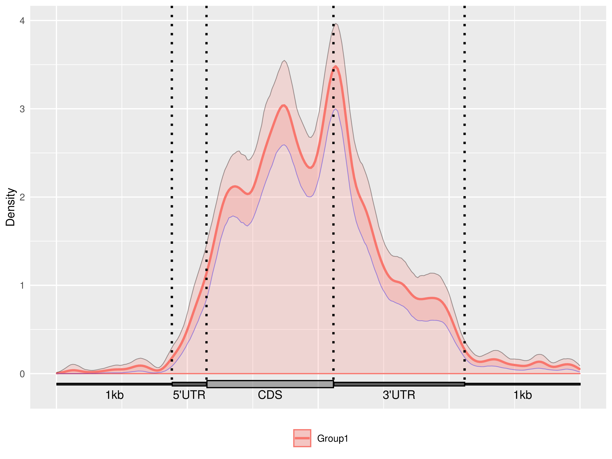

### Motif analysis 

__Results from FIRE__ shown above indicate that the known m6A site **DRACH** and **RGAC** (or `[AG]GAC` and `[AGT][AG]AC[ACT]` in regular expression form) is significantly enriched among the **~4700** methylations sites.

# RNA-seq data 

## Analysis workflow 
**Differential RNA Expression:** I've used `salmon` for alignment and `DESeq2` for ANNOVA like analysis (see [DESeq2 for time-series-experiments](http://bioconductor.org/packages/devel/bioc/vignettes/DESeq2/inst/doc/DESeq2.html#time-series-experiments.)). Mainly, the linear model designed as `~condition + time + condition:time` to include both time and treatment together in the model. 

**Differential RNA Stability:** Separately, I've used `STAR` for alignment and then, I've used `featureCount` to evalute intronic and exonic counts (similar to [CRIES](https://github.com/csglab/CRIES)). Then, [REMBRANDTS](https://github.com/csglab/REMBRANDTS) is the tool to estimate unbias transcript stability. Finally, I use `limma` for differential analysis. 

## Results 
## HL-60 cell line - Time series experiment
### Differential RNA Expression
#### hyper_mtyl_6h_delta_exp
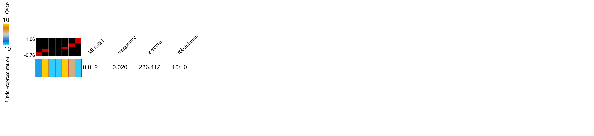

#### hypo_mtyl_6h_delta_exp
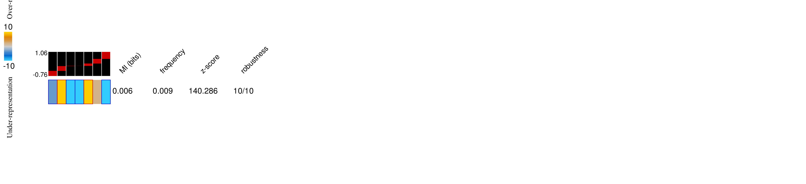

___

#### hyper_mtyl_72h_delta_exp

#### hypo_mtyl_72h_delta_exp
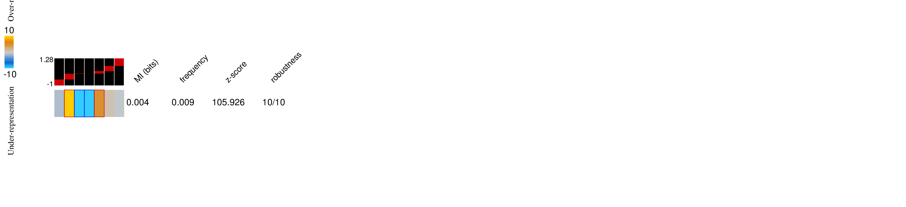

___

#### hyper_mtyl_120h_delta_exp

#### hypo_mtyl_120h_delta_exp

## 5 other AML cell lines 
#### hyper_mtyl_kg1_delta_exp
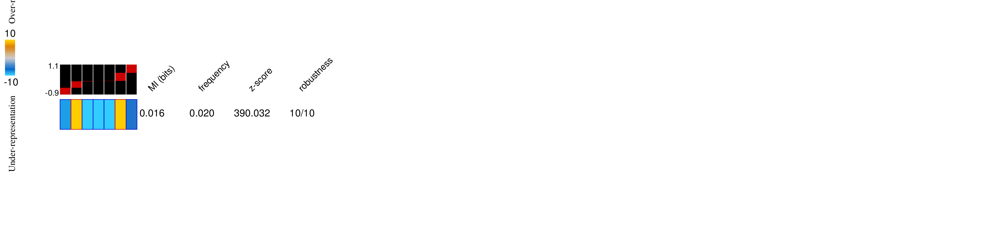

#### hypo_mtyl_kg1_delta_exp

___

#### hyper_mtyl_molm14_delta_exp
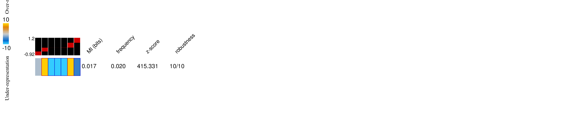

#### hypo_mtyl_molm14_delta_exp
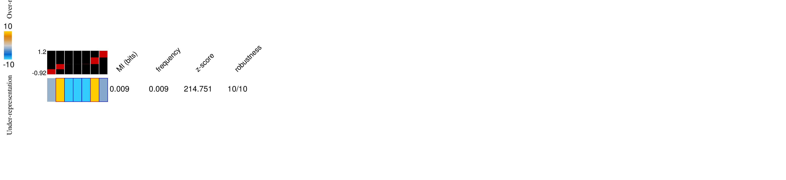

___

#### hyper_mtyl_ociaml2_delta_exp

#### hypo_mtyl_ociaml2_delta_exp
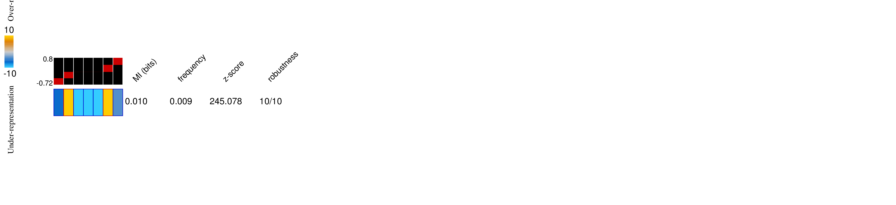

___

#### hyper_mtyl_ociaml3_delta_exp

#### hypo_mtyl_ociaml3_delta_exp

___

#### hyper_mtyl_thp1_delta_exp
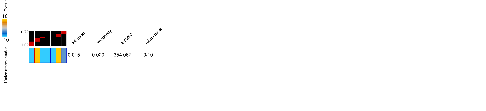

#### hypo_mtyl_thp1_delta_exp

### Differential RNA Stability 
#### hyper_mtyl_6h_delta_stbl

#### hypo_mtyl_6h_delta_stbl

___

#### hyper_mtyl_120h_delta_stbl
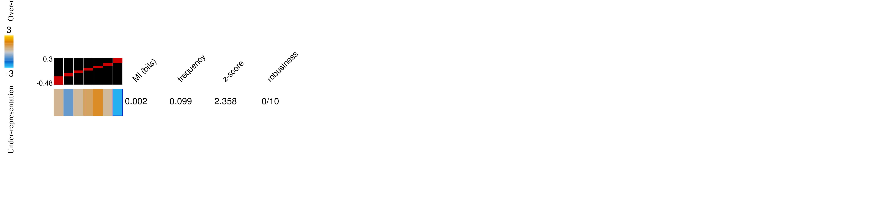

#### hypo_mtyl_120h_delta_stbl

## 5 other AML cell lines 
Test the enrichment of hyper methylated genes (logFC >= 2) and hypo methylated genes logFC

#### hyper_mtyl_kg1_delta_stbl
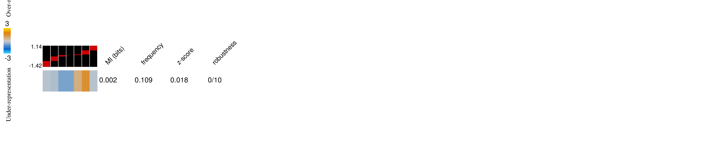

#### hypo_mtyl_kg1_delta_stbl

___

#### hyper_mtyl_molm14_delta_stbl

#### hypo_mtyl_molm14_delta_stbl

___

#### hyper_mtyl_ociaml2_delta_stbl
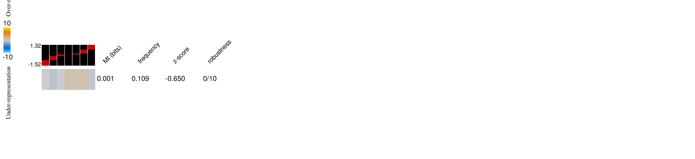

#### hypo_mtyl_ociaml2_delta_stbl

___

#### hyper_mtyl_ociaml3_delta_stbl

#### hypo_mtyl_ociaml3_delta_stbl

___

#### hyper_mtyl_thp1_delta_stbl

#### hypo_mtyl_thp1_delta_stbl
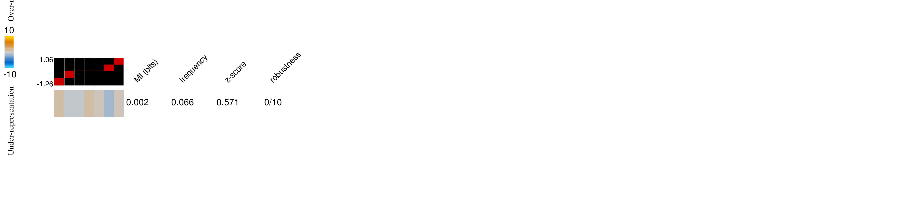

# Ribo-seq data
We have used [Ribolog](https://github.com/goodarzilab/Ribolog) to estimate differential translational efficiency (lnTE). 

#### hyper_mtyl_lnTE_T_vs_U
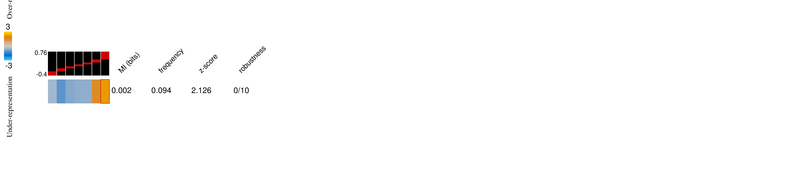

#### hypo_mtyl_lnTE_T_vs_U
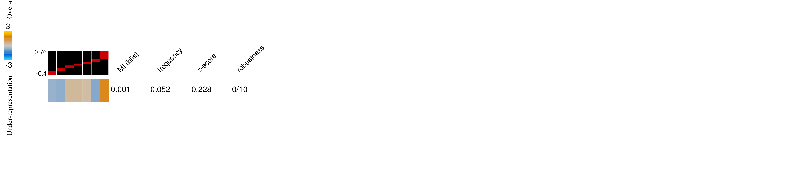
