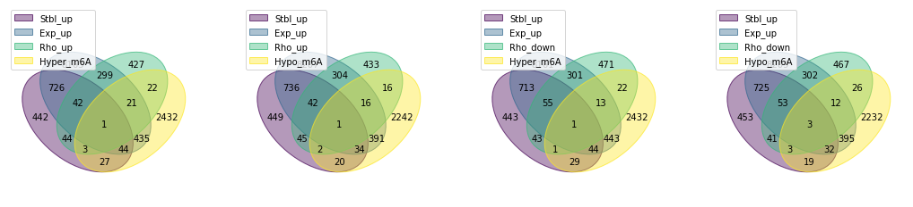
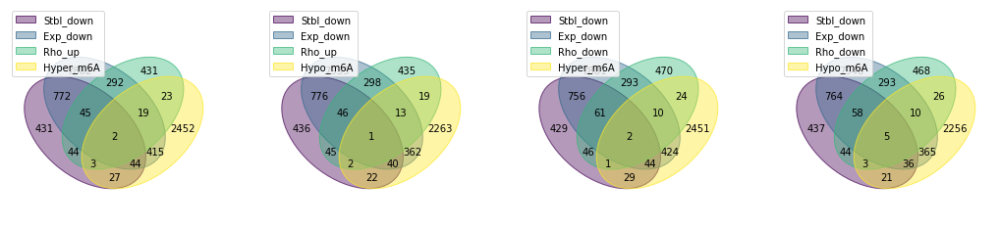

# Main goal: 
- Hani is looking for the final list of genes which are significantly drug induced methylated, expressed and stabilized. 

=> table of these genes with all logFCs, pvalues and screening scores. 


```python
import pandas as pd 
import numpy as np

from utility import *
```

# Intersectional genes 
Find top genes across all cell lines and high throughput experiments:

- $\Delta$RNA expression 
- $\Delta$RNA stability 
- $\Delta$RNA methylation  
- $\Delta$Phenotype (CRISPR Screen Rho score)
- $\Delta$Translational efficiency


```python
Top = {}

Top['TE']   = set_Top_TE  (0,0.05)
Top['Mtyl'] = set_Top_Mtyl(0,0.05)
Top['Rho']  = set_Top_Rho (0,0.05)
Top['Exp']  = set_Top_Exp (0,0.05, 1)
Top['Stbl'] = set_Top_Stbl(0,0.05, 1)

```

    Subset Top TE data frame:
    up:  40
    down: 11
    (te_thr=0, fdr_thr=0.05)
    Subset Top Mtyl data frame:
    up:  2986
    down: 2722
    (fc_thr=0, pv_thr=0.05)
    Subset Top Rho data frame:
    up:  859
    down: 907
    (sc_thr=0, pv_thr=0.05)
    Subset Top Exp data frame:
    up:  9736
    down: 9475
    (fc_thr=0, pv_thr=0.05) in more than 1 cell lines
    Subset Top Stbl data frame:
    up:  1329
    down: 1368
    (fc_thr=0, pv_thr=0.05) in more than 1 cell lines


### Intersection of all genes across different datasets

- https://pypi.org/project/venn/

Select top gene names 


```python
Exp_up = Top['Exp']['up'].gene_name.tolist()
Stbl_up = Top['Stbl']['up'].gene_name.tolist()
TE_up = Top['TE']['up'].gene_name.tolist()
Rho_up = Top['Rho']['up'].gene_name.tolist()
Hyper_m6A = Top['Mtyl']['up'].gene_name.tolist()

Exp_down = Top['Exp']['down'].gene_name.tolist()
Stbl_down = Top['Stbl']['down'].gene_name.tolist()
TE_down = Top['TE']['down'].gene_name.tolist()
Rho_down = Top['Rho']['down'].gene_name.tolist()
Hypo_m6A = Top['Mtyl']['down'].gene_name.tolist()
```


```python
import numpy as np
import itertools
from matplotlib.pyplot import subplots
from itertools import chain
from venn import venn 

def iter_by_two(input1,input2,input3):
    # inputs are variable names 
    # it will give 8 combinations 
    out = []
    for comb in list(itertools.product(input1,input2,input3)):
        a,b,c = comb
        out.append([a,b,c])
    return out 

studies = iter_by_two(['Exp_up', 'Exp_down'],['Rho_up', 'Rho_down'],['Hyper_m6A', 'Hypo_m6A'])
studies = [[s[0].replace('Exp','Stbl'),s[0],s[1],s[2]] for s in studies]

_, top_axs = subplots(ncols=4, nrows=1, figsize=(18, 8))
_, bot_axs = subplots(ncols=4, nrows=1, figsize=(18, 8))
# cmaps = ["cool", list("rgb"), "plasma", "viridis", "Set1"]
# letters = iter(ascii_uppercase)

for std,ax in zip(studies,chain(top_axs, bot_axs)):
    data = {}
    data = dict([[a,set(eval(a))] for a in std])
    venn(data,fontsize=10,legend_loc="upper left", ax=ax)
```


    

    


    

    


# Final merged table

### Rho_down & Exp_down & Stbl_down & Hyper_m6A


```python
hypothesis1 = list(set(Rho_down).intersection(Exp_down,Stbl_down,Hyper_m6A))

make_final_table(hypothesis1)
```


<div>
<style scoped>
    .dataframe tbody tr th:only-of-type {
        vertical-align: middle;
    }

    .dataframe tbody tr th {
        vertical-align: top;
    }

    .dataframe thead th {
        text-align: right;
    }
</style>
<table border="1" class="dataframe">
  <thead>
    <tr style="text-align: right;">
      <th></th>
      <th>Exp.hl60.log2FC_120h</th>
      <th>Exp.hl60.pval_120h</th>
      <th>Exp.kg1.log2FC</th>
      <th>Exp.kg1.pval</th>
      <th>Exp.molm14.log2FC</th>
      <th>Exp.molm14.pval</th>
      <th>Exp.ociaml2.log2FC</th>
      <th>Exp.ociaml2.pval</th>
      <th>Exp.ociaml3.log2FC</th>
      <th>Exp.ociaml3.pval</th>
      <th>...</th>
      <th>Stbl.ociaml3.logFC</th>
      <th>Stbl.ociaml3.pval</th>
      <th>Stbl.thp1.logFC</th>
      <th>Stbl.thp1.pval</th>
      <th>TE.Estimate_treatmentDRUG</th>
      <th>TE.fdr_Pr...z.._treatmentDRUG</th>
      <th>Rho.Mann-Whitney p-value</th>
      <th>Rho.rho score</th>
      <th>Gamma.Mann-Whitney p-value</th>
      <th>Gamma.gamma score</th>
    </tr>
    <tr>
      <th>gene_name</th>
      <th></th>
      <th></th>
      <th></th>
      <th></th>
      <th></th>
      <th></th>
      <th></th>
      <th></th>
      <th></th>
      <th></th>
      <th></th>
      <th></th>
      <th></th>
      <th></th>
      <th></th>
      <th></th>
      <th></th>
      <th></th>
      <th></th>
      <th></th>
      <th></th>
    </tr>
  </thead>
  <tbody>
    <tr>
      <th>MCM6</th>
      <td>-0.260608</td>
      <td>2.644117e-01</td>
      <td>-0.372325</td>
      <td>0.006128</td>
      <td>-0.706042</td>
      <td>0.000015</td>
      <td>-0.062433</td>
      <td>0.694125</td>
      <td>-0.377572</td>
      <td>0.011931</td>
      <td>...</td>
      <td>0.192816</td>
      <td>0.155195</td>
      <td>0.063040</td>
      <td>0.487625</td>
      <td>0.141152</td>
      <td>0.568586</td>
      <td>0.0176399</td>
      <td>-0.256772</td>
      <td>0.000117131</td>
      <td>-0.364115</td>
    </tr>
    <tr>
      <th>MEF2D</th>
      <td>1.563055</td>
      <td>1.371875e-08</td>
      <td>-0.031726</td>
      <td>0.891686</td>
      <td>-0.347330</td>
      <td>0.104679</td>
      <td>-0.220338</td>
      <td>0.216834</td>
      <td>-0.409503</td>
      <td>0.017260</td>
      <td>...</td>
      <td>0.228954</td>
      <td>0.115202</td>
      <td>0.120834</td>
      <td>0.277893</td>
      <td>0.119764</td>
      <td>0.907884</td>
      <td>0.0498476</td>
      <td>-0.0656627</td>
      <td>0.00318461</td>
      <td>-0.038707</td>
    </tr>
  </tbody>
</table>
<p>2 rows × 30 columns</p>
</div>


### Rho_down & Exp_down & Hyper_m6A


```python
hypothesis2 = list(set(Rho_down).intersection(Exp_down,Hyper_m6A))

make_final_table(hypothesis2)
```


<div>
<style scoped>
    .dataframe tbody tr th:only-of-type {
        vertical-align: middle;
    }

    .dataframe tbody tr th {
        vertical-align: top;
    }

    .dataframe thead th {
        text-align: right;
    }
</style>
<table border="1" class="dataframe">
  <thead>
    <tr style="text-align: right;">
      <th></th>
      <th>Exp.hl60.log2FC_120h</th>
      <th>Exp.hl60.pval_120h</th>
      <th>Exp.kg1.log2FC</th>
      <th>Exp.kg1.pval</th>
      <th>Exp.molm14.log2FC</th>
      <th>Exp.molm14.pval</th>
      <th>Exp.ociaml2.log2FC</th>
      <th>Exp.ociaml2.pval</th>
      <th>Exp.ociaml3.log2FC</th>
      <th>Exp.ociaml3.pval</th>
      <th>...</th>
      <th>Stbl.ociaml3.logFC</th>
      <th>Stbl.ociaml3.pval</th>
      <th>Stbl.thp1.logFC</th>
      <th>Stbl.thp1.pval</th>
      <th>TE.Estimate_treatmentDRUG</th>
      <th>TE.fdr_Pr...z.._treatmentDRUG</th>
      <th>Rho.Mann-Whitney p-value</th>
      <th>Rho.rho score</th>
      <th>Gamma.Mann-Whitney p-value</th>
      <th>Gamma.gamma score</th>
    </tr>
  </thead>
  <tbody>
    <tr>
      <th>ACBD3</th>
      <td>-0.255428</td>
      <td>2.956786e-04</td>
      <td>0.408222</td>
      <td>0.224012</td>
      <td>-0.004804</td>
      <td>9.774198e-01</td>
      <td>-0.033640</td>
      <td>0.839696</td>
      <td>0.277632</td>
      <td>0.272227</td>
      <td>...</td>
      <td>NaN</td>
      <td>NaN</td>
      <td>NaN</td>
      <td>NaN</td>
      <td>0.014849</td>
      <td>0.991344</td>
      <td>0.00126337</td>
      <td>-0.142158</td>
      <td>0.0168892</td>
      <td>0.0409318</td>
    </tr>
    <tr>
      <th>SFPQ</th>
      <td>-0.037906</td>
      <td>4.397616e-01</td>
      <td>-0.293200</td>
      <td>0.086317</td>
      <td>-0.317340</td>
      <td>4.290813e-02</td>
      <td>-0.175780</td>
      <td>0.304325</td>
      <td>-0.017672</td>
      <td>0.933338</td>
      <td>...</td>
      <td>-0.161741</td>
      <td>0.284903</td>
      <td>0.052482</td>
      <td>0.577053</td>
      <td>0.226904</td>
      <td>0.185863</td>
      <td>0.00230533</td>
      <td>-0.200517</td>
      <td>0.00880856</td>
      <td>-0.102862</td>
    </tr>
    <tr>
      <th>MEF2D</th>
      <td>1.563055</td>
      <td>1.371875e-08</td>
      <td>-0.031726</td>
      <td>0.891686</td>
      <td>-0.347330</td>
      <td>1.046792e-01</td>
      <td>-0.220338</td>
      <td>0.216834</td>
      <td>-0.409503</td>
      <td>0.017260</td>
      <td>...</td>
      <td>0.228954</td>
      <td>0.115202</td>
      <td>0.120834</td>
      <td>0.277893</td>
      <td>0.119764</td>
      <td>0.907884</td>
      <td>0.0498476</td>
      <td>-0.0656627</td>
      <td>0.00318461</td>
      <td>-0.038707</td>
    </tr>
    <tr>
      <th>MCM6</th>
      <td>-0.260608</td>
      <td>2.644117e-01</td>
      <td>-0.372325</td>
      <td>0.006128</td>
      <td>-0.706042</td>
      <td>1.485079e-05</td>
      <td>-0.062433</td>
      <td>0.694125</td>
      <td>-0.377572</td>
      <td>0.011931</td>
      <td>...</td>
      <td>0.192816</td>
      <td>0.155195</td>
      <td>0.063040</td>
      <td>0.487625</td>
      <td>0.141152</td>
      <td>0.568586</td>
      <td>0.0176399</td>
      <td>-0.256772</td>
      <td>0.000117131</td>
      <td>-0.364115</td>
    </tr>
    <tr>
      <th>MTF1</th>
      <td>-0.157071</td>
      <td>8.235729e-06</td>
      <td>0.016280</td>
      <td>0.937028</td>
      <td>-0.446972</td>
      <td>2.140451e-01</td>
      <td>0.305052</td>
      <td>0.204213</td>
      <td>0.002159</td>
      <td>0.993814</td>
      <td>...</td>
      <td>NaN</td>
      <td>NaN</td>
      <td>NaN</td>
      <td>NaN</td>
      <td>0.124444</td>
      <td>0.940129</td>
      <td>0.00201799</td>
      <td>-0.297069</td>
      <td>0.137841</td>
      <td>-0.146795</td>
    </tr>
    <tr>
      <th>UCK2</th>
      <td>1.413515</td>
      <td>3.036888e-11</td>
      <td>0.099486</td>
      <td>0.557710</td>
      <td>-0.166197</td>
      <td>3.703695e-01</td>
      <td>0.169666</td>
      <td>0.312809</td>
      <td>0.003967</td>
      <td>0.982084</td>
      <td>...</td>
      <td>NaN</td>
      <td>NaN</td>
      <td>NaN</td>
      <td>NaN</td>
      <td>0.407555</td>
      <td>0.543413</td>
      <td>0.00679669</td>
      <td>-0.141699</td>
      <td>0.600712</td>
      <td>-0.00531935</td>
    </tr>
    <tr>
      <th>LMO4</th>
      <td>-0.422088</td>
      <td>3.748506e-04</td>
      <td>0.595350</td>
      <td>0.001234</td>
      <td>-0.132534</td>
      <td>4.611962e-01</td>
      <td>-0.108333</td>
      <td>0.569185</td>
      <td>0.297329</td>
      <td>0.221916</td>
      <td>...</td>
      <td>-0.078583</td>
      <td>0.517867</td>
      <td>0.040331</td>
      <td>0.681654</td>
      <td>-0.122797</td>
      <td>0.927343</td>
      <td>0.020828</td>
      <td>-0.0850827</td>
      <td>0.122142</td>
      <td>0.0282576</td>
    </tr>
    <tr>
      <th>CHI3L2</th>
      <td>1.144042</td>
      <td>3.511034e-02</td>
      <td>2.592999</td>
      <td>0.249316</td>
      <td>-1.679973</td>
      <td>2.290830e-01</td>
      <td>-0.852745</td>
      <td>0.564122</td>
      <td>1.009644</td>
      <td>0.413695</td>
      <td>...</td>
      <td>NaN</td>
      <td>NaN</td>
      <td>NaN</td>
      <td>NaN</td>
      <td>NaN</td>
      <td>NaN</td>
      <td>0.0342496</td>
      <td>-0.134453</td>
      <td>0.255808</td>
      <td>-0.0222494</td>
    </tr>
    <tr>
      <th>ENO1</th>
      <td>-0.228210</td>
      <td>9.702674e-02</td>
      <td>-0.074568</td>
      <td>0.673064</td>
      <td>-0.349341</td>
      <td>4.168188e-02</td>
      <td>-0.035007</td>
      <td>0.820917</td>
      <td>0.142302</td>
      <td>0.610297</td>
      <td>...</td>
      <td>-0.051891</td>
      <td>0.721501</td>
      <td>0.002783</td>
      <td>0.981011</td>
      <td>0.170456</td>
      <td>0.022071</td>
      <td>0.0499464</td>
      <td>-0.220227</td>
      <td>0.971943</td>
      <td>-0.00204534</td>
    </tr>
    <tr>
      <th>SLC16A1</th>
      <td>1.800265</td>
      <td>2.891163e-24</td>
      <td>-0.206306</td>
      <td>0.193738</td>
      <td>-0.896546</td>
      <td>5.054270e-07</td>
      <td>-0.286578</td>
      <td>0.123413</td>
      <td>-0.597357</td>
      <td>0.000597</td>
      <td>...</td>
      <td>NaN</td>
      <td>NaN</td>
      <td>NaN</td>
      <td>NaN</td>
      <td>-1.849582</td>
      <td>0.192857</td>
      <td>0.00831795</td>
      <td>-0.178622</td>
      <td>0.196717</td>
      <td>-0.0273967</td>
    </tr>
    <tr>
      <th>AMY2A</th>
      <td>1.801883</td>
      <td>2.956038e-02</td>
      <td>-0.557272</td>
      <td>0.890247</td>
      <td>0.993406</td>
      <td>8.049595e-01</td>
      <td>-2.299423</td>
      <td>0.564383</td>
      <td>2.749730</td>
      <td>0.202518</td>
      <td>...</td>
      <td>NaN</td>
      <td>NaN</td>
      <td>NaN</td>
      <td>NaN</td>
      <td>NaN</td>
      <td>NaN</td>
      <td>0.0125431</td>
      <td>-0.093866</td>
      <td>0.52997</td>
      <td>-0.010743</td>
    </tr>
    <tr>
      <th>GPR35</th>
      <td>-0.722073</td>
      <td>9.664174e-06</td>
      <td>0.093674</td>
      <td>0.758931</td>
      <td>-0.528963</td>
      <td>4.576730e-01</td>
      <td>0.218798</td>
      <td>0.641025</td>
      <td>-0.179317</td>
      <td>0.588192</td>
      <td>...</td>
      <td>NaN</td>
      <td>NaN</td>
      <td>NaN</td>
      <td>NaN</td>
      <td>NaN</td>
      <td>NaN</td>
      <td>0.028282</td>
      <td>-0.136965</td>
      <td>0.194008</td>
      <td>0.00621635</td>
    </tr>
  </tbody>
</table>
<p>12 rows × 30 columns</p>
</div>


### Rho_up & Exp_down & Stbl_down & Hyper_m6A


```python
hypothesis3 = list(set(Rho_up).intersection(Exp_down,Stbl_down,Hyper_m6A))

make_final_table(hypothesis3)
```


<div>
<style scoped>
    .dataframe tbody tr th:only-of-type {
        vertical-align: middle;
    }

    .dataframe tbody tr th {
        vertical-align: top;
    }

    .dataframe thead th {
        text-align: right;
    }
</style>
<table border="1" class="dataframe">
  <thead>
    <tr style="text-align: right;">
      <th></th>
      <th>Exp.hl60.log2FC_120h</th>
      <th>Exp.hl60.pval_120h</th>
      <th>Exp.kg1.log2FC</th>
      <th>Exp.kg1.pval</th>
      <th>Exp.molm14.log2FC</th>
      <th>Exp.molm14.pval</th>
      <th>Exp.ociaml2.log2FC</th>
      <th>Exp.ociaml2.pval</th>
      <th>Exp.ociaml3.log2FC</th>
      <th>Exp.ociaml3.pval</th>
      <th>...</th>
      <th>Stbl.ociaml3.logFC</th>
      <th>Stbl.ociaml3.pval</th>
      <th>Stbl.thp1.logFC</th>
      <th>Stbl.thp1.pval</th>
      <th>TE.Estimate_treatmentDRUG</th>
      <th>TE.fdr_Pr...z.._treatmentDRUG</th>
      <th>Rho.Mann-Whitney p-value</th>
      <th>Rho.rho score</th>
      <th>Gamma.Mann-Whitney p-value</th>
      <th>Gamma.gamma score</th>
    </tr>
  </thead>
  <tbody>
    <tr>
      <th>MSH2</th>
      <td>0.570997</td>
      <td>9.345765e-09</td>
      <td>-0.327930</td>
      <td>0.062360</td>
      <td>-0.707776</td>
      <td>0.000106</td>
      <td>-0.234308</td>
      <td>0.213572</td>
      <td>-0.336881</td>
      <td>0.054838</td>
      <td>...</td>
      <td>-0.012684</td>
      <td>0.916366</td>
      <td>-0.167781</td>
      <td>0.221697</td>
      <td>0.154781</td>
      <td>0.722210</td>
      <td>0.00587056</td>
      <td>0.142873</td>
      <td>0.147186</td>
      <td>-0.0302337</td>
    </tr>
    <tr>
      <th>TMEM131</th>
      <td>-0.335044</td>
      <td>6.171198e-03</td>
      <td>-0.093577</td>
      <td>0.560429</td>
      <td>0.057964</td>
      <td>0.729947</td>
      <td>0.027949</td>
      <td>0.856325</td>
      <td>-0.017475</td>
      <td>0.931948</td>
      <td>...</td>
      <td>-0.202671</td>
      <td>0.121390</td>
      <td>-0.215341</td>
      <td>0.041291</td>
      <td>0.063921</td>
      <td>0.932726</td>
      <td>0.0222428</td>
      <td>0.161288</td>
      <td>0.00265797</td>
      <td>-0.0662091</td>
    </tr>
  </tbody>
</table>
<p>2 rows × 30 columns</p>
</div>


### Rho_up & Exp_down & Hyper_m6A


```python
hypothesis4 = list(set(Rho_up).intersection(Exp_down,Hyper_m6A))

make_final_table(hypothesis4)
```


<div>
<style scoped>
    .dataframe tbody tr th:only-of-type {
        vertical-align: middle;
    }

    .dataframe tbody tr th {
        vertical-align: top;
    }

    .dataframe thead th {
        text-align: right;
    }
</style>
<table border="1" class="dataframe">
  <thead>
    <tr style="text-align: right;">
      <th></th>
      <th>Exp.hl60.log2FC_120h</th>
      <th>Exp.hl60.pval_120h</th>
      <th>Exp.kg1.log2FC</th>
      <th>Exp.kg1.pval</th>
      <th>Exp.molm14.log2FC</th>
      <th>Exp.molm14.pval</th>
      <th>Exp.ociaml2.log2FC</th>
      <th>Exp.ociaml2.pval</th>
      <th>Exp.ociaml3.log2FC</th>
      <th>Exp.ociaml3.pval</th>
      <th>...</th>
      <th>Stbl.ociaml3.logFC</th>
      <th>Stbl.ociaml3.pval</th>
      <th>Stbl.thp1.logFC</th>
      <th>Stbl.thp1.pval</th>
      <th>TE.Estimate_treatmentDRUG</th>
      <th>TE.fdr_Pr...z.._treatmentDRUG</th>
      <th>Rho.Mann-Whitney p-value</th>
      <th>Rho.rho score</th>
      <th>Gamma.Mann-Whitney p-value</th>
      <th>Gamma.gamma score</th>
    </tr>
  </thead>
  <tbody>
    <tr>
      <th>SLC6A20</th>
      <td>1.206834</td>
      <td>2.519860e-02</td>
      <td>0.918088</td>
      <td>0.352388</td>
      <td>1.259865</td>
      <td>0.271128</td>
      <td>-2.650165</td>
      <td>0.012432</td>
      <td>1.071316</td>
      <td>0.201365</td>
      <td>...</td>
      <td>NaN</td>
      <td>NaN</td>
      <td>NaN</td>
      <td>NaN</td>
      <td>NaN</td>
      <td>NaN</td>
      <td>0.0432376</td>
      <td>0.0774343</td>
      <td>0.628967</td>
      <td>-0.010128</td>
    </tr>
    <tr>
      <th>MRPL9</th>
      <td>1.800786</td>
      <td>5.643539e-12</td>
      <td>-0.286210</td>
      <td>0.102172</td>
      <td>-0.287571</td>
      <td>0.150551</td>
      <td>0.250177</td>
      <td>0.287494</td>
      <td>-0.518568</td>
      <td>0.038305</td>
      <td>...</td>
      <td>NaN</td>
      <td>NaN</td>
      <td>NaN</td>
      <td>NaN</td>
      <td>-0.155038</td>
      <td>0.893222</td>
      <td>0.00288828</td>
      <td>0.144698</td>
      <td>0.00025029</td>
      <td>-0.232271</td>
    </tr>
    <tr>
      <th>TTC24</th>
      <td>1.719701</td>
      <td>7.960186e-01</td>
      <td>-1.325101</td>
      <td>0.042348</td>
      <td>NaN</td>
      <td>NaN</td>
      <td>0.400511</td>
      <td>0.861518</td>
      <td>-1.826989</td>
      <td>0.651439</td>
      <td>...</td>
      <td>NaN</td>
      <td>NaN</td>
      <td>NaN</td>
      <td>NaN</td>
      <td>NaN</td>
      <td>NaN</td>
      <td>0.00262083</td>
      <td>0.1697</td>
      <td>0.974615</td>
      <td>0.0355165</td>
    </tr>
    <tr>
      <th>CTSK</th>
      <td>0.619149</td>
      <td>2.040619e-01</td>
      <td>0.139430</td>
      <td>0.899428</td>
      <td>0.496117</td>
      <td>0.645394</td>
      <td>-1.639188</td>
      <td>0.178626</td>
      <td>0.554341</td>
      <td>0.412652</td>
      <td>...</td>
      <td>NaN</td>
      <td>NaN</td>
      <td>NaN</td>
      <td>NaN</td>
      <td>NaN</td>
      <td>NaN</td>
      <td>0.046755</td>
      <td>0.0904569</td>
      <td>0.494404</td>
      <td>-0.0195168</td>
    </tr>
    <tr>
      <th>GREB1</th>
      <td>0.590645</td>
      <td>4.565783e-01</td>
      <td>-0.152567</td>
      <td>0.715700</td>
      <td>0.282140</td>
      <td>0.808558</td>
      <td>0.576708</td>
      <td>0.540513</td>
      <td>-1.171591</td>
      <td>0.026395</td>
      <td>...</td>
      <td>NaN</td>
      <td>NaN</td>
      <td>NaN</td>
      <td>NaN</td>
      <td>NaN</td>
      <td>NaN</td>
      <td>0.0198208</td>
      <td>0.0869877</td>
      <td>0.184415</td>
      <td>0.0561801</td>
    </tr>
    <tr>
      <th>HNRNPU</th>
      <td>-0.129759</td>
      <td>4.354481e-01</td>
      <td>-0.216745</td>
      <td>0.246770</td>
      <td>-0.456809</td>
      <td>0.002849</td>
      <td>0.115574</td>
      <td>0.365777</td>
      <td>0.096698</td>
      <td>0.643306</td>
      <td>...</td>
      <td>0.020860</td>
      <td>0.889410</td>
      <td>-0.004460</td>
      <td>0.964859</td>
      <td>0.268148</td>
      <td>0.001581</td>
      <td>0.0489654</td>
      <td>0.132367</td>
      <td>0.383809</td>
      <td>-0.0425436</td>
    </tr>
    <tr>
      <th>CDK18</th>
      <td>0.738440</td>
      <td>7.287003e-01</td>
      <td>0.201004</td>
      <td>0.897594</td>
      <td>0.584568</td>
      <td>0.149347</td>
      <td>0.269656</td>
      <td>0.405711</td>
      <td>-0.443172</td>
      <td>0.157660</td>
      <td>...</td>
      <td>NaN</td>
      <td>NaN</td>
      <td>NaN</td>
      <td>NaN</td>
      <td>NaN</td>
      <td>NaN</td>
      <td>0.0231814</td>
      <td>0.126849</td>
      <td>0.190298</td>
      <td>-0.0206226</td>
    </tr>
    <tr>
      <th>SRM</th>
      <td>1.333044</td>
      <td>1.167008e-09</td>
      <td>-0.387935</td>
      <td>0.098412</td>
      <td>-0.190280</td>
      <td>0.511287</td>
      <td>-0.030205</td>
      <td>0.875547</td>
      <td>0.050346</td>
      <td>0.832267</td>
      <td>...</td>
      <td>NaN</td>
      <td>NaN</td>
      <td>NaN</td>
      <td>NaN</td>
      <td>0.196854</td>
      <td>0.707356</td>
      <td>0.0336788</td>
      <td>0.0798143</td>
      <td>0.114066</td>
      <td>-0.0727709</td>
    </tr>
    <tr>
      <th>NUP35</th>
      <td>-0.157252</td>
      <td>8.366084e-02</td>
      <td>-0.078150</td>
      <td>0.738598</td>
      <td>-0.534280</td>
      <td>0.030826</td>
      <td>-0.087652</td>
      <td>0.703460</td>
      <td>-0.127036</td>
      <td>0.600484</td>
      <td>...</td>
      <td>NaN</td>
      <td>NaN</td>
      <td>NaN</td>
      <td>NaN</td>
      <td>-0.195545</td>
      <td>0.877835</td>
      <td>0.00438646</td>
      <td>0.133577</td>
      <td>0.370689</td>
      <td>0.00643263</td>
    </tr>
    <tr>
      <th>SLC40A1</th>
      <td>-1.805903</td>
      <td>9.157184e-22</td>
      <td>0.220866</td>
      <td>0.333506</td>
      <td>-0.752589</td>
      <td>0.596286</td>
      <td>0.461624</td>
      <td>0.023219</td>
      <td>1.539103</td>
      <td>0.000218</td>
      <td>...</td>
      <td>NaN</td>
      <td>NaN</td>
      <td>NaN</td>
      <td>NaN</td>
      <td>NaN</td>
      <td>NaN</td>
      <td>0.00545656</td>
      <td>0.106535</td>
      <td>0.565091</td>
      <td>0.0277337</td>
    </tr>
    <tr>
      <th>SAMD13</th>
      <td>2.697858</td>
      <td>1.429860e-03</td>
      <td>-0.305478</td>
      <td>0.581785</td>
      <td>-0.158482</td>
      <td>0.788260</td>
      <td>0.318479</td>
      <td>0.653815</td>
      <td>-0.646936</td>
      <td>0.643254</td>
      <td>...</td>
      <td>NaN</td>
      <td>NaN</td>
      <td>NaN</td>
      <td>NaN</td>
      <td>NaN</td>
      <td>NaN</td>
      <td>0.00489573</td>
      <td>0.111218</td>
      <td>0.203665</td>
      <td>0.00682179</td>
    </tr>
    <tr>
      <th>BMP8B</th>
      <td>0.819192</td>
      <td>1.527067e-03</td>
      <td>0.140958</td>
      <td>0.786972</td>
      <td>0.025062</td>
      <td>0.894030</td>
      <td>-0.072460</td>
      <td>0.597073</td>
      <td>0.563463</td>
      <td>0.000412</td>
      <td>...</td>
      <td>NaN</td>
      <td>NaN</td>
      <td>NaN</td>
      <td>NaN</td>
      <td>NaN</td>
      <td>NaN</td>
      <td>0.0236276</td>
      <td>0.0922899</td>
      <td>0.268999</td>
      <td>-0.0143093</td>
    </tr>
    <tr>
      <th>TMEM131</th>
      <td>-0.335044</td>
      <td>6.171198e-03</td>
      <td>-0.093577</td>
      <td>0.560429</td>
      <td>0.057964</td>
      <td>0.729947</td>
      <td>0.027949</td>
      <td>0.856325</td>
      <td>-0.017475</td>
      <td>0.931948</td>
      <td>...</td>
      <td>-0.202671</td>
      <td>0.121390</td>
      <td>-0.215341</td>
      <td>0.041291</td>
      <td>0.063921</td>
      <td>0.932726</td>
      <td>0.0222428</td>
      <td>0.161288</td>
      <td>0.00265797</td>
      <td>-0.0662091</td>
    </tr>
    <tr>
      <th>RETSAT</th>
      <td>0.293910</td>
      <td>3.116350e-01</td>
      <td>-0.357805</td>
      <td>0.357041</td>
      <td>0.788125</td>
      <td>0.004258</td>
      <td>0.430948</td>
      <td>0.176807</td>
      <td>0.521691</td>
      <td>0.146683</td>
      <td>...</td>
      <td>NaN</td>
      <td>NaN</td>
      <td>NaN</td>
      <td>NaN</td>
      <td>0.029562</td>
      <td>0.988401</td>
      <td>0.0373066</td>
      <td>0.148801</td>
      <td>0.453571</td>
      <td>-0.0118136</td>
    </tr>
    <tr>
      <th>SSB</th>
      <td>1.206584</td>
      <td>4.399248e-04</td>
      <td>-0.011084</td>
      <td>0.945075</td>
      <td>-0.256049</td>
      <td>0.113667</td>
      <td>0.006027</td>
      <td>0.976421</td>
      <td>0.030441</td>
      <td>0.916677</td>
      <td>...</td>
      <td>NaN</td>
      <td>NaN</td>
      <td>NaN</td>
      <td>NaN</td>
      <td>0.130178</td>
      <td>0.780711</td>
      <td>0.00951027</td>
      <td>0.199131</td>
      <td>0.000226838</td>
      <td>-0.205369</td>
    </tr>
    <tr>
      <th>MSH2</th>
      <td>0.570997</td>
      <td>9.345765e-09</td>
      <td>-0.327930</td>
      <td>0.062360</td>
      <td>-0.707776</td>
      <td>0.000106</td>
      <td>-0.234308</td>
      <td>0.213572</td>
      <td>-0.336881</td>
      <td>0.054838</td>
      <td>...</td>
      <td>-0.012684</td>
      <td>0.916366</td>
      <td>-0.167781</td>
      <td>0.221697</td>
      <td>0.154781</td>
      <td>0.722210</td>
      <td>0.00587056</td>
      <td>0.142873</td>
      <td>0.147186</td>
      <td>-0.0302337</td>
    </tr>
    <tr>
      <th>AHDC1</th>
      <td>0.364656</td>
      <td>2.982186e-03</td>
      <td>-0.370352</td>
      <td>0.226922</td>
      <td>0.056858</td>
      <td>0.865928</td>
      <td>0.004764</td>
      <td>0.993084</td>
      <td>0.248048</td>
      <td>0.581709</td>
      <td>...</td>
      <td>NaN</td>
      <td>NaN</td>
      <td>NaN</td>
      <td>NaN</td>
      <td>-0.198277</td>
      <td>0.927907</td>
      <td>0.0481923</td>
      <td>0.0721406</td>
      <td>0.731346</td>
      <td>-0.00303373</td>
    </tr>
    <tr>
      <th>SMYD3</th>
      <td>-0.318052</td>
      <td>4.653470e-01</td>
      <td>0.199514</td>
      <td>0.204869</td>
      <td>-0.067999</td>
      <td>0.691954</td>
      <td>-0.205786</td>
      <td>0.178188</td>
      <td>-0.014195</td>
      <td>0.942268</td>
      <td>...</td>
      <td>NaN</td>
      <td>NaN</td>
      <td>NaN</td>
      <td>NaN</td>
      <td>-0.157867</td>
      <td>0.934031</td>
      <td>0.0462115</td>
      <td>0.0743541</td>
      <td>0.175711</td>
      <td>-0.0207636</td>
    </tr>
    <tr>
      <th>SMIM12</th>
      <td>0.919938</td>
      <td>7.251180e-07</td>
      <td>-0.313624</td>
      <td>0.329383</td>
      <td>0.102123</td>
      <td>0.689345</td>
      <td>0.284827</td>
      <td>0.233304</td>
      <td>0.265253</td>
      <td>0.492096</td>
      <td>...</td>
      <td>NaN</td>
      <td>NaN</td>
      <td>NaN</td>
      <td>NaN</td>
      <td>0.260382</td>
      <td>0.878780</td>
      <td>0.0223228</td>
      <td>0.100061</td>
      <td>0.151677</td>
      <td>-0.0290833</td>
    </tr>
    <tr>
      <th>SSR2</th>
      <td>-0.038453</td>
      <td>9.497834e-01</td>
      <td>0.427878</td>
      <td>0.015550</td>
      <td>0.171407</td>
      <td>0.354462</td>
      <td>0.178020</td>
      <td>0.202149</td>
      <td>-0.072072</td>
      <td>0.664912</td>
      <td>...</td>
      <td>NaN</td>
      <td>NaN</td>
      <td>NaN</td>
      <td>NaN</td>
      <td>0.022685</td>
      <td>0.971238</td>
      <td>0.0279785</td>
      <td>0.15602</td>
      <td>0.0727247</td>
      <td>-0.0257302</td>
    </tr>
    <tr>
      <th>TPRKB</th>
      <td>0.112887</td>
      <td>3.063846e-05</td>
      <td>-0.027734</td>
      <td>0.910611</td>
      <td>-0.135479</td>
      <td>0.630298</td>
      <td>-0.163795</td>
      <td>0.492134</td>
      <td>-0.204264</td>
      <td>0.430332</td>
      <td>...</td>
      <td>NaN</td>
      <td>NaN</td>
      <td>NaN</td>
      <td>NaN</td>
      <td>0.064802</td>
      <td>0.959597</td>
      <td>0.0416847</td>
      <td>0.160599</td>
      <td>0.173848</td>
      <td>-0.0647234</td>
    </tr>
  </tbody>
</table>
<p>21 rows × 30 columns</p>
</div>


