# Metagene plots
**metagene plots** 

<table>
  <tr>
    <td>
  <tr>
<table>
<table>
  <tr>
    <td>
    <td>
  <tr>
<table>

# FIRE 
https://github.com/goodarzilab/FIRE

### DRACH & RGAC motifs
- [AG]GAC
- [AGT][AG]AC[ACT]


# iPAGE
https://github.com/goodarzilab/PAGE

### msigdb_hallmarks
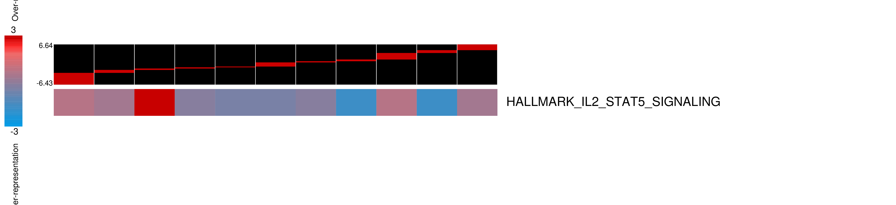

<!-- ### msigdb_c1
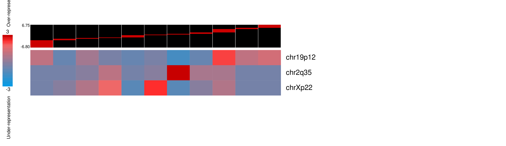
 -->
<!-- ### msigdb_c2 -->
<!-- 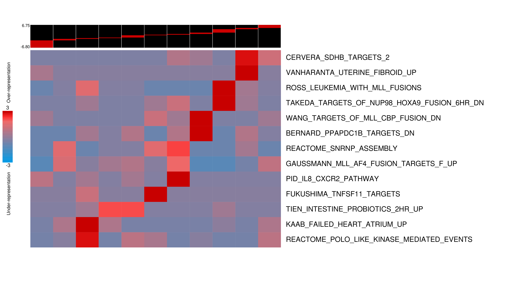 -->

### msigdb_c3
<!-- 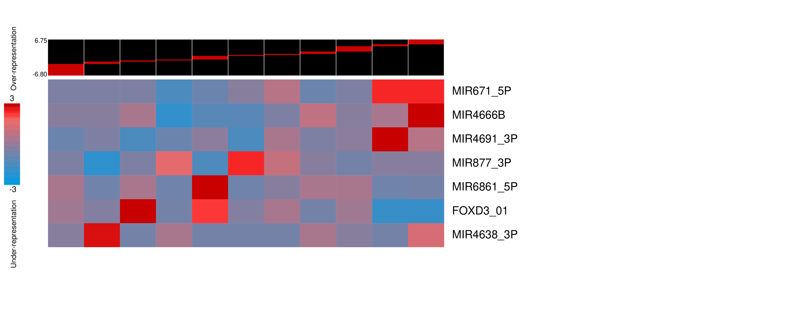 -->
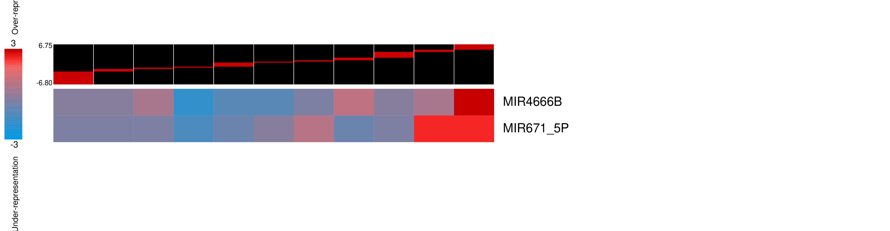


```python
cat d_mtyl_T_vs_U/human_ensembl_msigdb_c3/pvmatrix.txt.killed 
```

    MIR4666B, MIR4666B
    	MIR6730_3P, MIR6730_3P
    	MIR3064_3P, MIR3064_3P
    MIR671_5P, MIR671_5P
    	HIVEP1_TARGET_GENES, HIVEP1_TARGET_GENES

<!-- ### msigdb_c4
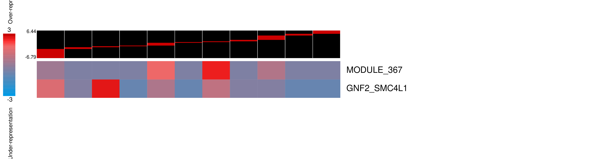 -->

### msigdb_c5
<!-- 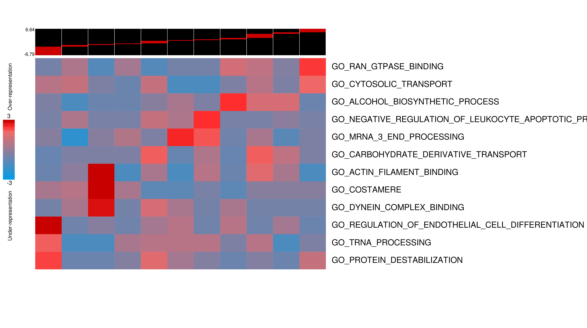 -->
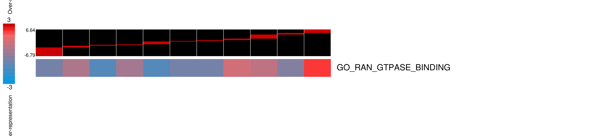
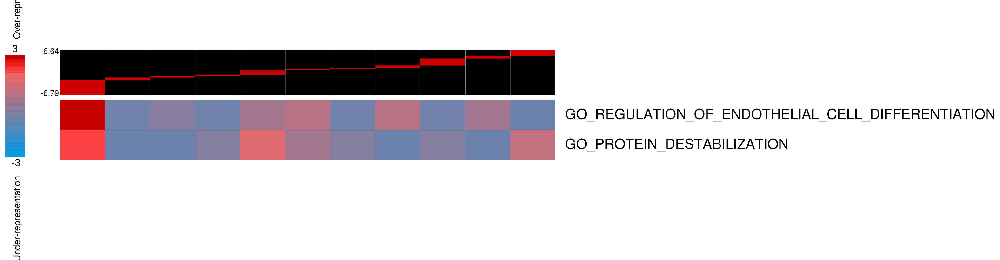


```python
cat d_mtyl_T_vs_U/human_ensembl_msigdb_c5/pvmatrix.txt.killed 
```

    GO_PROTEIN_DESTABILIZATION, GO_PROTEIN_DESTABILIZATION
    	GO_PEPTIDYL_LYSINE_ACETYLATION, GO_PEPTIDYL_LYSINE_ACETYLATION
    	GO_TRANSCRIPTION_INITIATION_FROM_RNA_POLYMERASE_II_PROMOTER, GO_TRANSCRIPTION_INITIATION_FROM_RNA_POLYMERASE_II_PROMOTER
    	GO_PROTEIN_ACETYLATION, GO_PROTEIN_ACETYLATION
    	GO_LIPID_HOMEOSTASIS, GO_LIPID_HOMEOSTASIS
    	GO_REGULATION_OF_ANDROGEN_RECEPTOR_SIGNALING_PATHWAY, GO_REGULATION_OF_ANDROGEN_RECEPTOR_SIGNALING_PATHWAY
    	GO_NUCLEOTIDE_EXCISION_REPAIR, GO_NUCLEOTIDE_EXCISION_REPAIR
    GO_RAN_GTPASE_BINDING, GO_RAN_GTPASE_BINDING
    	GO_NLS_BEARING_PROTEIN_IMPORT_INTO_NUCLEUS, GO_NLS_BEARING_PROTEIN_IMPORT_INTO_NUCLEUS
    	GO_REGULATION_OF_CARBOHYDRATE_CATABOLIC_PROCESS, GO_REGULATION_OF_CARBOHYDRATE_CATABOLIC_PROCESS
    	GO_NUCLEAR_PORE, GO_NUCLEAR_PORE
    	GO_PROTEIN_IMPORT, GO_PROTEIN_IMPORT
    GO_REGULATION_OF_ENDOTHELIAL_CELL_DIFFERENTIATION, GO_REGULATION_OF_ENDOTHELIAL_CELL_DIFFERENTIATION
    	GO_REGULATION_OF_EPITHELIAL_CELL_DIFFERENTIATION, GO_REGULATION_OF_EPITHELIAL_CELL_DIFFERENTIATION
    	GO_POSITIVE_REGULATION_OF_DEVELOPMENTAL_GROWTH, GO_POSITIVE_REGULATION_OF_DEVELOPMENTAL_GROWTH
    	GO_REGULATION_OF_MUSCLE_ORGAN_DEVELOPMENT, GO_REGULATION_OF_MUSCLE_ORGAN_DEVELOPMENT
    	GO_CENTROSOME_DUPLICATION, GO_CENTROSOME_DUPLICATION
    	GO_HEART_VALVE_DEVELOPMENT, GO_HEART_VALVE_DEVELOPMENT
    	GO_NEURON_FATE_COMMITMENT, GO_NEURON_FATE_COMMITMENT
    	GO_PULMONARY_VALVE_MORPHOGENESIS, GO_PULMONARY_VALVE_MORPHOGENESIS
    	GO_POSITIVE_REGULATION_OF_NOTCH_SIGNALING_PATHWAY, GO_POSITIVE_REGULATION_OF_NOTCH_SIGNALING_PATHWAY
    	GO_POSITIVE_REGULATION_OF_SMALL_GTPASE_MEDIATED_SIGNAL_TRANSDUCTION, GO_POSITIVE_REGULATION_OF_SMALL_GTPASE_MEDIATED_SIGNAL_TRANSDUCTION
    GO_TRNA_PROCESSING, GO_TRNA_PROCESSING
    	GO_RNA_3_END_PROCESSING, GO_RNA_3_END_PROCESSING
    	GO_RNA_METHYLATION, GO_RNA_METHYLATION


<!-- ### msigdb_c6
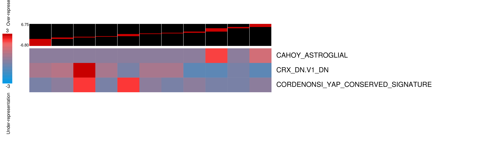 -->

### msigdb_c7
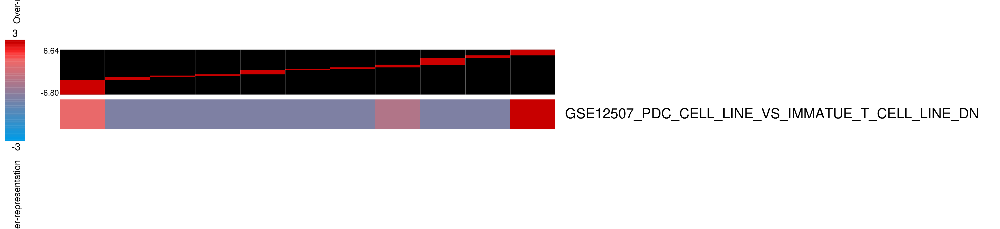


```python
cat d_mtyl_T_vs_U/human_ensembl_msigdb_c7/pvmatrix.txt.killed 
```

    GSE12507_PDC_CELL_LINE_VS_IMMATUE_T_CELL_LINE_DN, GSE12507_PDC_CELL_LINE_VS_IMMATUE_T_CELL_LINE_DN
    	GSE37532_TREG_VS_TCONV_CD4_TCELL_FROM_LN_UP, GSE37532_TREG_VS_TCONV_CD4_TCELL_FROM_LN_UP
    	GSE20715_0H_VS_6H_OZONE_LUNG_DN, GSE20715_0H_VS_6H_OZONE_LUNG_DN
    	GSE3982_EOSINOPHIL_VS_TH2_UP, GSE3982_EOSINOPHIL_VS_TH2_UP
    	GSE36527_CD62L_HIGH_CD69_NEG_VS_CD62L_LOW_CD69_POS_TREG_KLRG1_NEG_DN, GSE36527_CD62L_HIGH_CD69_NEG_VS_CD62L_LOW_CD69_POS_TREG_KLRG1_NEG_DN

### msigdb_full
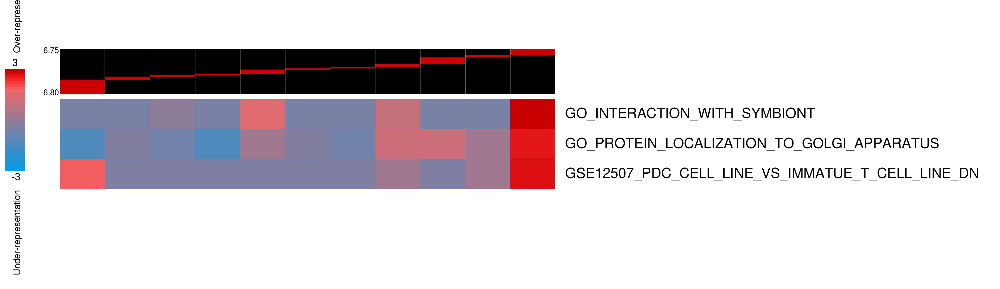

<!-- ### human_ensembl
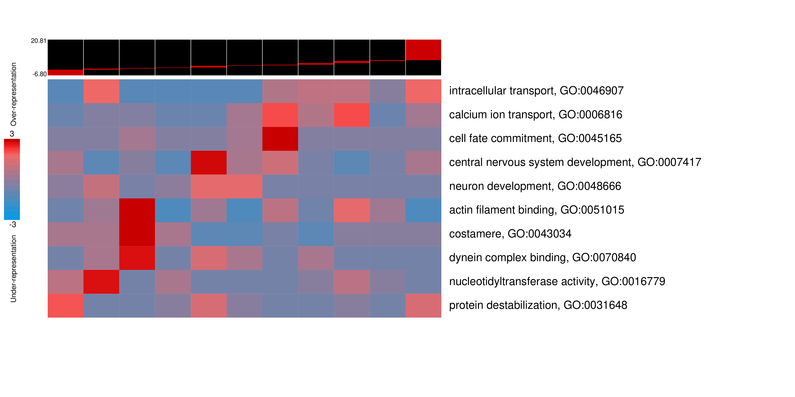 -->

<!-- ### RBPs_coding_gene_ids_by_5UTR
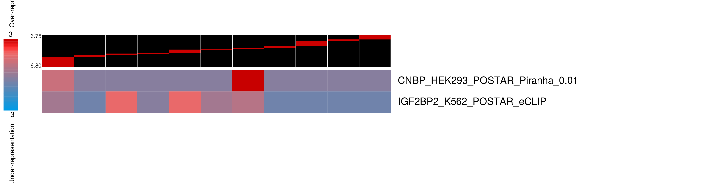 -->

<!-- ### RBPs_coding_gene_ids_by_coding_exons
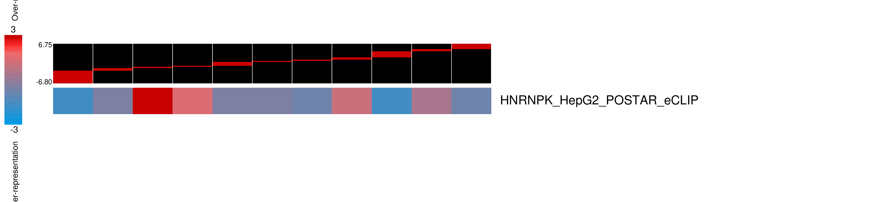 -->

<!-- ### RBPs_coding_gene_ids_by_introns
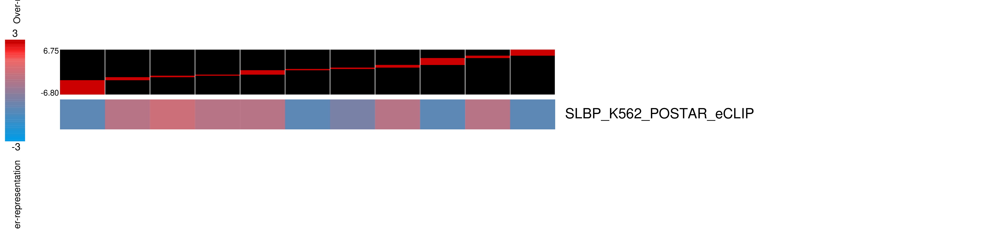
 -->
